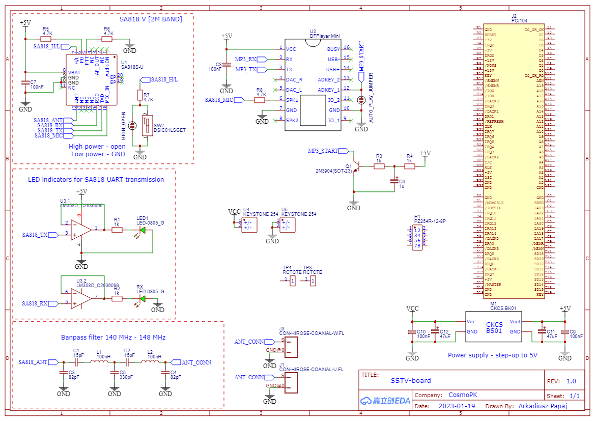

# habsat2-sstv-board
SSTV board for 2m band (144.500 MHz in Poland) in PC104 form factor.

Filter for 144.500 MHz - SA818 (and DRA818) is noisy

LEDs: :blue_circle:(power), :green_circle:(ok), :yellow_circle:(warning), :red_circle:(failure, NOT power indicator)

TO DO:
1. add switch? remove-before-flight? to power on board
2. check circuit for time delayed start of MP3
3. add LED indicators for UART MP3?
4. add JST? connector for li-pol battery - for now support only for single 18650 cell (dimension needed)
4. rearrange elements on PCB to have standalone SSTV module after EOF
5. where put u.FL connectors, soldering pads for antenna?
6. additional filtering on MIC line?
7. doublecheck pull-up and pull-down resistors

Links:
1. https://wstratosfere.pl/work/sstv-do-balonu-krotkofalarskiego/
2. https://rf-tools.com/lc-filter/
3. https://gabunz.wordpress.com/2021/04/24/autostart-autoplay-am-dfplayer-mini-ohne-arduino-mikrocontroller/